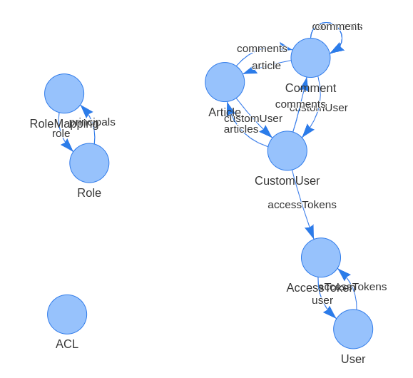

# loopback-vue-getting-started

Build a Blogging platform with nested commenting feature using loopback, vue.js, semantic-ui and mongodb.

### Prerequisite

* Make sure that you have `npm`, `nodejs` and `mongodb` installed on your machine

### How to run

1. Clone the repository `git clone https://github.com/varunon9/loopback-vue-getting-started.git`
2. Move to project directory `cd loopback-vue-getting-started`
3. [Optional] Edit the `./server/datasources.json` file if you want to change username/port/db name
4. Run the project `nodemon` or `npm run start-debug` (for debugging)
5. You can visit http://localhost:3000/explorer/ to explore the API
6. Go to client directory `cd client` and build project `npm run build`
7. Now you can visit http://localhost:3000/ and browse the single page application
8. Check `client/README.md` for Frontend development

### Functionalities

1. Login and Signup
2. Authenticated users can create an article.
3. Authenticated users can comment (or edit comment) on an article.
4. Authenticated users can reply (or edit reply) to comments.
5. Any user can browse articles, comments as well as replies.

#### Models visualization using loopback-component-visualizer

* Visit http://localhost:3000/visualize

